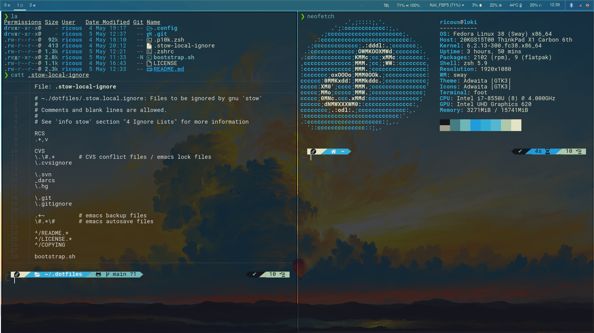

# Dotfiles
> :warning: **WARNING**: These will change a lot and may cause issues for some.

My personal configuration files for a Linux setup. I use [gnu stow](https://www.gnu.org/software/stow/) to manage the files.
This repo mimics the structure of a user home directory and exists in *$HOME/.dotfiles*.

## Stow
This repo is setup to use stow.

To install all:
`stow .`

To delete symlinks created by stow:
`stow -D .`

## Configuration Items
Some of my configuration files assume certain programs are installed. These
should be installed for proper use.

#### General Requirements:
- [pywal](https://github.com/dylanaraps/pywal) - pretty color themes by wallpaper
- [nerfont](https://www.nerdfonts.com/) - any nerdfont will do, but I use robotomono.

### Sway
[Sway](https://swaywm.org/) is a window manager. I prefer this over the
typical desktop environments like **Gnome**.

> :information_source: You will want to change the config.d/10-input.conf to match your keyboard preference.

#### Requirements:

### Waybar
[Waybar](https://github.com/Alexays/Waybar) is a great information bar
that pairs well with Sway.

#### Requirements:

### Rofi
I use [rofi](https://github.com/davatorium/rofi) as the main way to launch windows in
sway. The config only references the colors cached by pywal.

### Zsh
[Zsh](https://www.zsh.org/) is the preferred shell for most daily activities. My
brain likes pretty things. I do not use [OhMyZsh](https://ohmyz.sh/) however as
it seems heavy. I do use other tools that might seem heavy which contradicts this
decision but oh well. I do use the infamous [Powerlevel10k](https://github.com/romkatv/powerlevel10k)
theme.

#### Requirements:
- [fzf](https://github.com/junegunn/fzf) - fuzzy searching; used with ctrl+r zsh history
- [exa](https://the.exa.website/) - better ls outputs
- vim - because my brain doesn't know how to be normal anymore

### NeoVim
I finally decided to use [NeoVim](https://neovim.io/) because I like LUA and
it seems more useful than vimscript. [Computercraft](https://www.computercraft.info/)
prepared me for this moment.

> :information_source: Currently using [astrovim](https://github.com/AstroNvim/AstroNvim) but will build
my own from scratch soon. Not all requirements are listed.

Requirements:
- gem: neovim
- pip: pynvim
- lazygit
- ruby-devel
- ripgrep
- fd-find
- node
